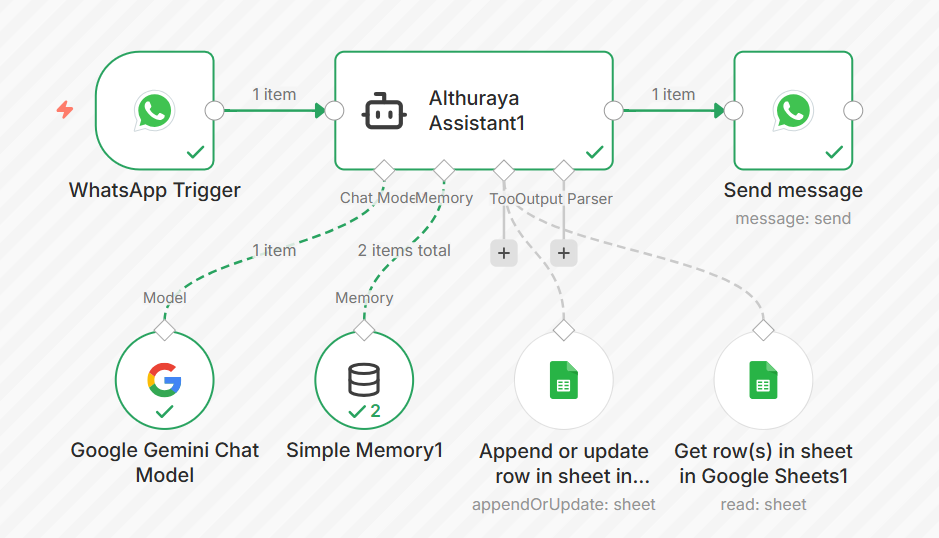
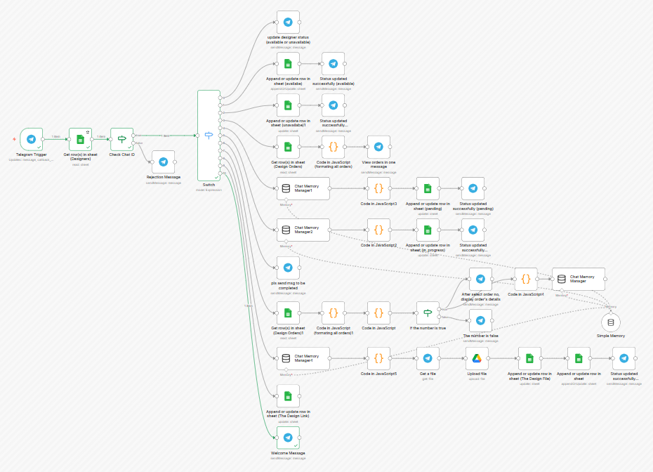

# Althuraya Invitations – Automation System Project

Designed and implemented an automation system for [Althuraya Invitations Store/](https://althuraya.store/) during my internship at Althuraya Venture Builder, using WhatsApp and Telegram bots with n8n to manage orders, automate pricing, and streamline workflow operations. Developed as an individual project.

---

## 🚀 Overview

This project is a full automation system that manages the entire invitation ordering workflow:

- Collects customer requests via WhatsApp  
- Processes and calculates pricing automatically  
- Stores data in Google Sheets  
- Sends orders to designers via Telegram  
- Allows customers to track orders using a unique order ID  

The system reduces manual work and creates a seamless flow between customers and designers.

---

## 🧠 System Architecture

### WhatsApp Bot (Customer Flow)



Handles:
- Customer interaction  
- Data collection (event details)  
- Pricing calculation  
- Order confirmation  
- Saving data to Google Sheets  
- Sending order to Telegram  
- Order tracking via order ID  

---

### Telegram Bot (Designer Flow)



Handles:
- Designer authentication  
- Viewing orders  
- Updating order status  
- Uploading final design  
- Updating Google Sheets  

---

## 📂 Project Structure

```bash
Althuraya_Invitations/
│
├── workflows/        # n8n workflows (JSON files)
│   ├── customer-bot-workflow.json
│   └── designer-bot-workflow.json
│
├── scenarios/        # Detailed system scenarios (PDF)
│   ├── customer-bot-scenario.pdf
│   └── designer-bot-scenario.pdf
│
├── images/           # Workflow diagrams
│   ├── customer-bot-workflow-diagram.png
│   └── designer-bot-workflow-diagram.png
│
└── README.md
```

---

## ⚙️ Technologies Used

- n8n (Automation engine)  
- WhatsApp Business API  
- Telegram Bot API  
- Google Sheets (Database)  
- Google Gemini AI (for smart responses)  

---

## 🔄 Workflow Explanation

### 1. Customer Side (WhatsApp)

- User sends a message  
- Bot collects event details step-by-step  
- System calculates price automatically  
- Order is confirmed  
- Data is stored in Google Sheets  
- Order is sent to Telegram  
- Customer can check order status using order ID  

📄 Full scenario: [Customer Bot Scenario](scenarios/customer-bot-scenario.pdf)

---

### 2. Designer Side (Telegram)

- Designer is verified using Chat ID  
- Views available orders  
- Updates order status (Pending / In Progress / Completed)  
- Uploads final design  
- System updates Google Sheets  

📄 Full scenario: [Designer Bot Scenario](scenarios/designer-bot-scenario.pdf)

---

## 🔍 Order Tracking

Customers can easily track their orders using a unique order ID:

- Enter order ID via WhatsApp  
- System retrieves order data from Google Sheets  
- Returns current status (Pending / In Progress / Completed)  

---

## 💡 Key Features

- Fully automated workflow  
- No manual data entry  
- Order tracking system via order ID  
- Smart pricing system  
- Integration between multiple platforms  

---

## 🔮 Future Improvements

- Continuous system optimization and performance improvements  
- Advanced UX enhancements for a smoother user experience  
- Strengthening AI agent prompt engineering for higher accuracy and controlled responses  

- Real-time notification system:
  - Notify designers when a new order is received  
  - Notify customers when their order is completed  

- Integration of a secure payment system for full automation  

---

## 🏁 Conclusion

This system demonstrates how automation tools like n8n can transform a traditional service into a scalable, efficient digital workflow.
